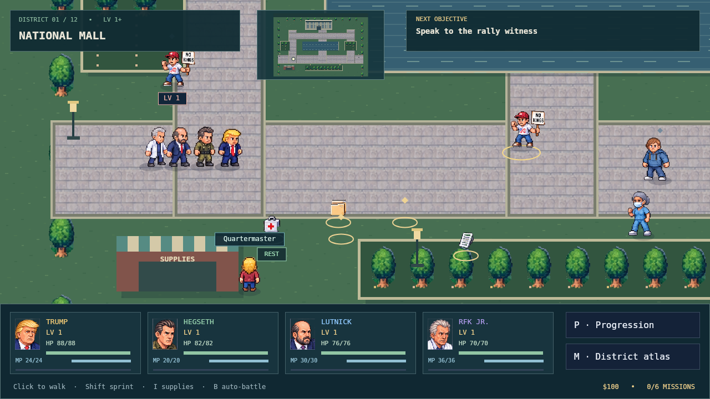
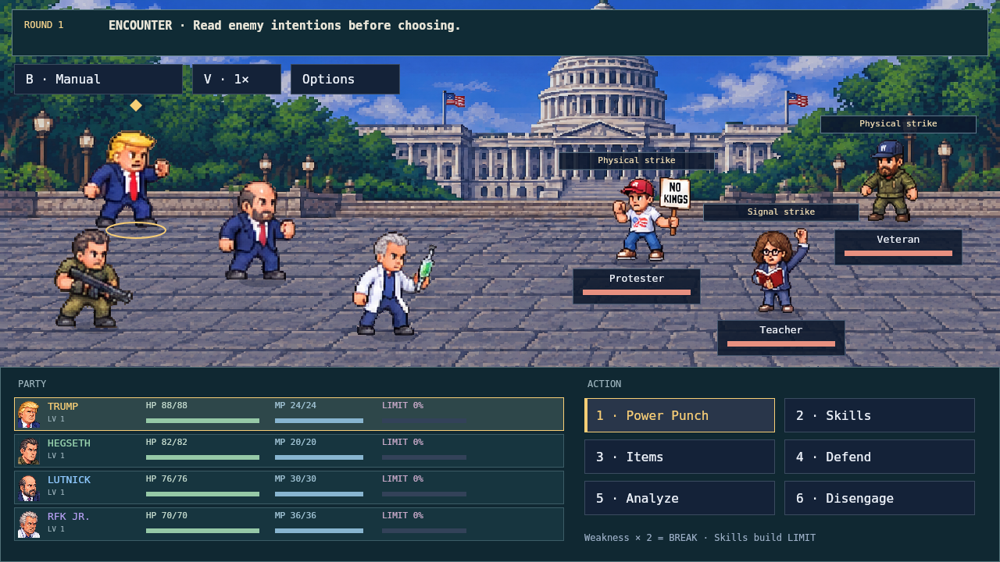
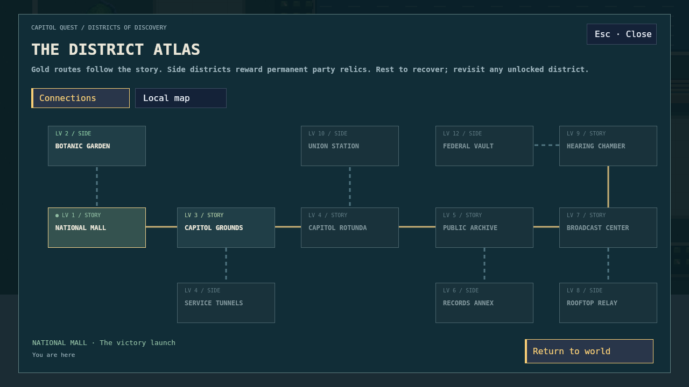

# Capitol Quest

A work-in-progress joke RPG inspired by the Trump administration's recent game-related posts and [White House Arcade launch](https://abcnews.com/Technology/wireStory/white-house-website-debuts-5-retro-arcade-video-136188912).

This is just the first okay version. I might work on it more later, or I might not. Expect bugs and rough edges. It's an independent fictional game, with no affiliation with the administration.



## Play

Clone the repo and open `index.html` in your browser. The committed browser bundle runs without a build step or dependencies. Keep `dist`, `styles`, and `assets` beside `index.html`.

WASD / arrows to move, Shift to sprint, E / Enter to interact. M opens the map, P progression, I supplies, Q the journal, and Esc pause. B opens auto-battle options; V changes battle speed.

## Game views

Turn-based battles, twelve districts, side quests, leveling, and optional auto-battle. These images are rendered directly from the game canvas.

Heroes start with 70–88 HP and 20–36 MP. Each level adds 6 HP and 2 MP; skills unlock at levels 1, 2, 4, 7 and 11. Recover with supplies and rest points. Earlier saves automatically adopt the new stat scale while keeping levels, talents, training and story progress.





## Sprites

The [original full sprite sheet](assets/atlas.png) and the extracted sheets are included in [assets](assets/). See [asset notes](ASSET_NOTES.md) for provenance and [testing notes](QA.md) for the current limits.

## Development

Use Node.js 22 or newer:

```sh
npm ci
npm run build
npm test
```

Edit the files in `src/` and `styles/`, then rebuild and commit `dist/game.js` and `assets/sprite_masks.json` with the source changes. `npm run screenshots` refreshes the three views above. `npm run review:sprites` produces a complete before/after gallery of all 125 sprite frames in `.tmp/review/`.

| Location | Responsibility |
| --- | --- |
| `src/data/` | Party, enemies, items, districts, sprite metadata |
| `src/world/` | Movement, pathfinding, interactions, dialogue, travel |
| `src/battle/` | Combat actions, turns, damage, encounters, automation |
| `src/progression/` and `src/state/` | Leveling, talents, state, save migration |
| `src/rendering/` and `src/ui/` | Sprite caching, scenery, effects, menus, HUD |
| `src/input/` and `src/audio/` | Keyboard, pointer, touch, synthesized sound |
| `src/runtime/` | Canvas setup, helpers, loop, startup, debug hooks |
| `scripts/` and `tests/` | Build, transparency masks, regression checks |

The source components share one private lexical scope in the generated bundle. `scripts/sources.json` defines their initialization order. Functions have explicit implementations and named helpers; later scripts no longer replace earlier functions. Startup binds events and starts the loop after all components are initialized.

Actor rectangles and foot anchors come from `assets/actors_manifest.json`; landmark rectangles come from `assets/landmarks_manifest.json`. The build consumes these directly so rendering has one source of truth for each frame.
